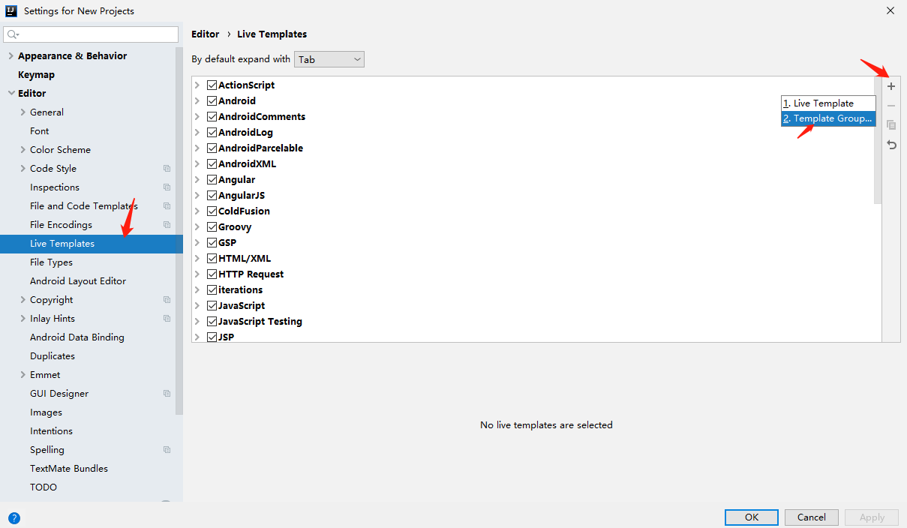
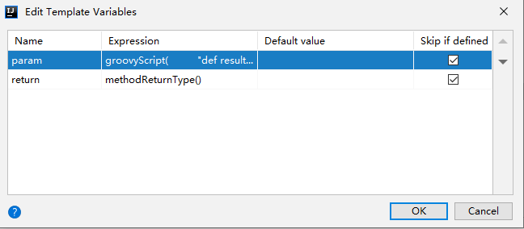

# idea 注释配置

## 一、类头注释

打开file -> setting -> Editor -> Filr and Code Templates -> Includes -> File Header 


```
/**
 * description: 
 *
 * @author xiangfei
 * @date ${DATE} ${TIME}
 */
```

## 一、方法注释

打开 file -> setting -> Editor -> LiveTemplates




```
**
 * description: 
 * 
$param$ 
 * @return $return$
 */
```



```
groovyScript(         "def result='';          def params=\"${_1}\".replaceAll('[\\\\[|\\\\]|\\\\s]', '').split(',').toList();          for(i = 0; i < params.size(); i++) {             result +=' * @param ' + params[i] + ((i < params.size() - 1) ? '\\n' : '')};              return result ", methodParameters())
```

